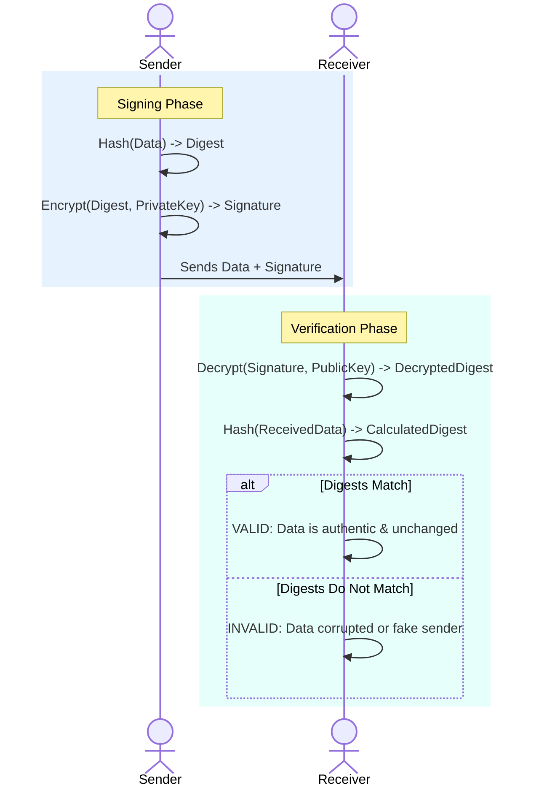
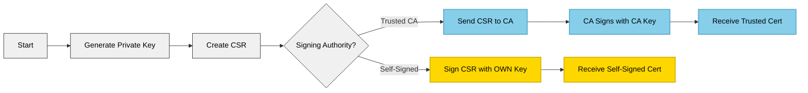

# Digital Signatures and Self-Signed Certificates

This document explains the theory behind digital signatures and certificates, followed by a hands-on guide to creating self-signed certificates using OpenSSL.

## 1. Theory: Digital Signatures

### What is a Digital Signature?
A digital signature is a cryptographic mechanism used to verify the authenticity and integrity of digital data. It is the digital equivalent of a handwritten signature or a stamped seal, but it offers far more inherent security.

Digital signatures rely on **Asymmetric Cryptography** (Public-Key Cryptography), which uses a pair of keys:
*   **Private Key**: Kept secret by the owner. Used for *signing*.
*   **Public Key**: Shared with everyone. Used for *verifying*.

### Quick Reference: Signing vs. Encryption

| Goal | Action | Sender Uses | Receiver Uses |
| :--- | :--- | :--- | :--- |
| **Digital Signature** | Prove Authenticity | **Private Key** (Sign) | **Public Key** (Verify) |
| **Encryption** | Keep it Secret | **Public Key** (Encrypt) | **Private Key** (Decrypt) |

### The Goals
1.  **Authentication**: Verifies that the message came from the claimed sender (since only they have the private key).
2.  **Integrity**: Verifies that the message was not altered in transit (any change to the data invalidates the signature).
3.  **Non-Repudiation**: The signer cannot deny having signed the message (as only their private key could have created the specific signature).

### How It Works

#### The Signing Process (Sender)
1.  **Hash**: A cryptographic hash function (like SHA-256) is applied to the original data to create a fixed-size **Digest**. This ensures efficiency and integrity.
2.  **Encrypt**: The Digest is encrypted using the sender's **Private Key**.
3.  **Result**: This encrypted digest is the **Digital Signature**. It is attached to the original data.

#### The Verification Process (Receiver)
1.  **Decrypt**: The receiver takes the digital signature and decrypts it using the sender's **Public Key**. This reveals the *original* Digest.
2.  **Hash**: The receiver takes the received data and applies the *same* hash function to create a *new* Digest.
3.  **Compare**: The receiver compares the *decrypted* Digest with the *calculated* Digest.
    *   If they match, the signature is **valid**.
    *   If they differ, the data was tampered with or not signed by the claimed key.

### Visualization (Mermaid)



---

## 2. Practical: Hashing in Action

Before diving into certificates, it's crucial to understand hashing, as it's the foundation of digital signatures.

### What is a Hash?
A hash function takes input data of any size and produces a fixed-size string of characters (the hash). 
*   **Deterministic**: Same input always produces the same hash.
*   **One-way**: You cannot reverse the hash to get the original data.
*   **Avalanche Effect**: A tiny change in input produces a completely different hash.

### Hands-On: Hashing with OpenSSL

Try these commands in your terminal to see hashing in action.

**1. Create a simple text file:**
```bash
echo "Hello World" > message.txt
```

**2. Generate a SHA-256 hash:**
```bash
openssl dgst -sha256 message.txt
# Output example: SHA256(message.txt)= a591a6d40bf420404a011733cfb7b190d62c65bf0bcda32b57b277d9ad9f146e
```

**3. Modify the file slightly:**
```bash
echo "Hello World." > message.txt
# Added a period
```

**4. Generate the hash again:**
```bash
openssl dgst -sha256 message.txt
# Output example: SHA256(message.txt)= f960d705c74323c6d74112e457F89786a34559c3a07205166f272a2752119932
```
*Notice completely different the hash is! This demonstrates the "Avalanche Effect".*

### Student Exercise 1: Hashing
1.  Create a file named `contract.txt` with the text: "I agree to pay $100".
2.  Generate the SHA-256 hash of this file. Record the first 4 characters.
3.  Change "$100" to "$1000".
4.  Generate the hash again. 
5.  **Question**: Did the hash change significantly or just slightly? What does this tell you about the reliability of hashing for detecting tampering?

---

## 3. Theory: Digital Certificates & CAs

While a digital signature proves *ownership* of a private key, it doesn't prove *who* the owner is. This is where **Digital Certificates** come in.

### What is a Digital Certificate?
A digital certificate is like a digital passport. It binds a **Public Key** to an **Identity** (like a person, organization, or domain name).

It contains:
*   **Subject Info**: Name, Organization, Domain (CN).
*   **Public Key**: The subject's public key.
*   **Issuer Signature**: A digital signature from a trusted third party (Certificate Authority) verifying this binding.

### Certificate Authority (CA)
A CA is a trusted entity that issues digital certificates.
1.  **Root CA**: The highest level of trust. Root certificates are pre-installed in browsers and OSs.
2.  **Intermediate CA**: Trusted by the Root CA to issue certificates on its behalf.
3.  **Leaf Certificate**: The end-entity certificate (e.g., for `google.com`).

### Chain of Trust
When a browser visits a website, it verifies the certificate by checking its issuer's signature. It follows the chain up until it reaches a trusted Root CA.

### Self-Signed Certificates
A **Self-Signed Certificate** is a certificate where the issuer is the same as the subject.
*   **Issuer**: Same as Subject.
*   **Signature**: Signed with its own Private Key.
*   **Trust**: Not trusted by browsers/OSs by default (because anyone can sign their own certificate).
*   **Use Cases**: Internal testing, development environments, intranets where you can manually distribute the certificate.

---

## 4. Student Exercise 2: Analyzing Real-World Certificates (Google.com)

**Goal**: Inspect the certificate of a major website (google.com) to understand how the Chain of Trust works in the real world.

### Step 1: Fetch the Certificate Chain
We will use `openssl s_client` to connect to google.com and retrieve its certificate information.

Run the following command in your terminal:

```bash
openssl s_client -connect google.com:443 -showcerts
```
*   `s_client`: A generic SSL/TLS client tool.
*   `-connect google.com:443`: Connect to Google on the standard HTTPS port.
*   `-showcerts`: Display the entire certificate chain sent by the server.

### Step 2: Analyze the Output (Key Findings)
The output is long, but here is a "Cheat Sheet" for what you just saw in the terminal:

1.  **The Chain of Trust**: Look for `Certificate chain`.
    - `0 s:CN=*.google.com`: The **Leaf** (website) certificate.
    - `1 s:CN=WE2`: The **Intermediate CA** that signed Google's cert.
    - `2 s:CN=GTS Root R4`: The **Root CA** (or a link to it).
    *Check the `i:` (Issuer) and `s:` (Subject) of each level to see how the "Chain" is linked.*

2.  **Subject Alternative Name (SAN)**: 
    - Search for `X509v3 Subject Alternative Name`.
    - Notice that one certificate for `*.google.com` also covers `youtube.com`, `android.com`, and hundreds of other domains!

3.  **Validity**:
    - Look for `Not Before` and `Not After`.
    - Big sites like Google often use short-lived certificates (e.g., 3 months) for better security through rotation.

4.  **Public Key Info**:
    - Search for `Public Key Algorithm`.
    - Modern sites use `id-ecPublicKey` (Elliptic Curve) which is much faster and uses smaller keys than older RSA keys for the same security.

### Step 3: Deep Dive into Details (Optional)
To see the certificate details in a readable format, we can pipe the output to `openssl x509`.

Run this command:
```bash
echo | openssl s_client -connect google.com:443 | openssl x509 -noout -text
```

**Find the following information:**
1.  **Issuer**: Who issued this certificate? (e.g., Google Trust Services).
2.  **Validity**:
    *   `Not Before`: When did it become valid?
    *   `Not After`: When does it expire? (Notice how short the validity period usually is for big sites!).
3.  **Subject Alternative Name (SAN)**:
    *   Scroll down to `X509v3 Subject Alternative Name`.
    *   See how many other domains this one certificate covers (e.g., `youtube.com`, `android.com`).

---

## 5. Hands-On: Self-Signing with OpenSSL

In this section, we will generate a self-signed certificate. This is essentially acting as your own Certificate Authority.

### Prerequisites
*   **OpenSSL**: Ensure OpenSSL is installed. It comes pre-installed on macOS and most Linux distros. On Windows, use Git Bash or WSL.

### Step 1: Generate a Private Key
First, we need a private key. This key will be used to sign the certificate.

```bash
# Generate a 2048-bit RSA private key and save it to 'my-key.pem'
openssl genrsa -out my-key.pem 2048
```
*   `genrsa`: Command to generate RSA private key.
*   `-out my-key.pem`: Output file.
*   `2048`: Key size in bits (2048 is standard secure).

### Step 2: Create a Certificate Signing Request (CSR)
A CSR contains your identity information (Country, Org, Domain) and your Public Key. Normally, you send this to a CA (like VeriSign or Let's Encrypt). For self-signing, we just process it ourselves.

```bash
# Create a CSR using the private key
openssl req -new -key my-key.pem -out my-request.csr
```
*   `req -new`: Create a new request.
*   `-key my-key.pem`: Use the key we just generated.
*   Interactive prompts will appear. You can enter `.` to leave fields empty. The most important field is **Common Name (CN)** (e.g., `localhost` or `mydomain.local`).

### Step 3: Generate the Self-Signed Certificate
Now, we act as the CA and sign our own request using our own private key.

```bash
# Sign the CSR with the private key to create a certificate valid for 365 days
openssl x509 -req -days 365 -in my-request.csr -signkey my-key.pem -out my-cert.crt
```
*   `x509`: Standard for Public Key Infrastructure (PKI).
*   `-req`: Data is a CSR.
*   `-days 365`: Validity period.
*   `-in`: Input CSR.
*   `-signkey`: Key used to sign the certificate (self-signing).
*   `-out`: Output certificate file.

### Workflow Visualization



### Verifying the Contents
You can inspect the contents of your new certificate:

```bash
openssl x509 -in my-cert.crt -text -noout
```
Look for the **Issuer** and **Subject** fields. In a self-signed certificate, they will be identical.

---

## 6. Student Exercise 3: Be Your Own CA
**Goal**: Create a valid self-signed certificate for a fictional local website development environment.

**Scenario**: You are developing a website locally called `dev.my-awesome-site.local`. You need to enable HTTPS for testing, so you need a certificate.

**Tasks**:
1.  **Generate Key**: Create a private key named `dev-site.key`.
2.  **Create CSR**: Generate a Certificate Signing Request named `dev-site.csr`.
    *   *Important*: When asked for "Common Name", enter `dev.my-awesome-site.local`.
3.  **Self-Sign**: Generate the certificate `dev-site.crt` valid for **30 days**.
4.  **Verification**: 
    - Run the command to inspect the certificate.
    - Confirm the **Issuer** is the same as the **Subject**.
    - Confirm the **Validity** shows it expires in 30 days.

**Bonus Challenge**:
Find the command to view the "Modulus" (Public Key) of both the Private Key and the Certificate. They should match.
*Hint: `openssl rsa -noout -modulus -in ...` and `openssl x509 -noout -modulus -in ...`*

---

## Appendix A: Implementing a Simple HTTPS Server in Plain Java

This appendix demonstrates how to use the concepts of self-signed certificates in a real Java application. We will create a simple HTTP server that runs over HTTPS, using a self-signed certificate we generate.

### Step 1: Generate a Keystore & Self-Signed Certificate
Java uses a **Keystore** (usually a `.p12` or `.jks` file) to store private keys and certificates. 

**Important Note**: In this example, we are NOT creating a Certificate Signing Request (CSR) and we are NOT sending it to a Certificate Authority (CA). The `keytool -genkeypair` command generates a private key and immediately creates a corresponding public certificate that is **self-signed**. The certificate acts as its own CA.

Run this command in your terminal:

```bash
keytool -genkeypair -alias my-self-signed -keyalg RSA -keysize 2048 -storetype PKCS12 -keystore my-keystore.p12 -validity 365 -storepass password -dname "CN=localhost, OU=Dev, O=MyOrg, L=City, S=State, C=US"
```
*   `-genkeypair`: Generates a key pair (public and private keys).
*   `-alias`: A name to identify this entry in the keystore.
*   `-keystore`: The name of the keystore file to create.
*   `-storepass`: The password to protect the keystore (we are using "password" for simplicity).
*   `-dname`: Specifies the "Distinguished Name". **CN=localhost** is critical because we will connect to `https://localhost`.

### Step 2: Export the Certificate
To use this certificate with tools like `curl`, we need to export the public certificate from the keystore into a file.

```bash
keytool -exportcert -alias my-self-signed -keystore my-keystore.p12 -storepass password -rfc -file my-cert.pem
```
*   `-exportcert`: Exports the certificate.
*   `-rfc`: Outputs in PEM format (readable text format starting with `-----BEGIN CERTIFICATE-----`).
*   `-file`: The output file name.

### Step 3: The Java HTTPS Server Code 
Create a file named `SimpleHttpsServer.java` with the following content. This code loads the keystore and starts an HTTPS server on port 8443.

```java
import com.sun.net.httpserver.HttpsServer;
import com.sun.net.httpserver.HttpsConfigurator;
import com.sun.net.httpserver.HttpsParameters;
import java.io.FileInputStream;
import java.io.OutputStream;
import java.net.InetSocketAddress;
import java.security.KeyStore;
import javax.net.ssl.KeyManagerFactory;
import javax.net.ssl.SSLContext;
import javax.net.ssl.SSLParameters;
import javax.net.ssl.SSLEngine;
import javax.net.ssl.TrustManagerFactory;

public class SimpleHttpsServer {

    public static void main(String[] args) throws Exception {
        // 1. Load the Keystore
        char[] password = "password".toCharArray();
        KeyStore ks = KeyStore.getInstance("PKCS12");
        try (FileInputStream fis = new FileInputStream("my-keystore.p12")) {
            ks.load(fis, password);
        }

        // 2. Initialize Key Manager (to use our Private Key)
        KeyManagerFactory kmf = KeyManagerFactory.getInstance("SunX509");
        kmf.init(ks, password);

        // 3. Initialize SSL Context
        SSLContext sslContext = SSLContext.getInstance("TLS");
        sslContext.init(kmf.getKeyManagers(), null, null);

        // 4. Create the HTTPS Server
        HttpsServer server = HttpsServer.create(new InetSocketAddress(8443), 0);
        server.setHttpsConfigurator(new HttpsConfigurator(sslContext) {
            public void configure(HttpsParameters params) {
                try {
                    // Initialize the SSL context for this HttpsParameters
                    SSLContext c = getSSLContext();
                    SSLEngine engine = c.createSSLEngine();
                    params.setNeedClientAuth(false);
                    params.setCipherSuites(engine.getEnabledCipherSuites());
                    params.setProtocols(engine.getEnabledProtocols());

                    // Get the default parameters
                    SSLParameters defaultSSLParameters = c.getDefaultSSLParameters();
                    params.setSSLParameters(defaultSSLParameters);
                } catch (Exception ex) {
                    ex.printStackTrace();
                }
            }
        });

        // 5. Create a Context (Endpoint)
        server.createContext("/", exchange -> {
            String response = "Hello, Secure World! You have successfully connected via HTTPS.";
            exchange.sendResponseHeaders(200, response.length());
            try (OutputStream os = exchange.getResponseBody()) {
                os.write(response.getBytes());
            }
        });

        System.out.println("HTTPS Server started on port 8443");
        server.start();
    }
}
```

**Compile and Run:**
```bash
javac SimpleHttpsServer.java
java SimpleHttpsServer
```

### Step 4: Connecting with Curl (The "Self-Signed CA" Check)

If you try to connect simply using `curl https://localhost:8443`, it will fail because `curl` does not trust your self-signed certificate.

**The Fix:** Tell `curl` to trust your specific certificate using the `--cacert` flag.

```bash
curl --cacert my-cert.pem https://localhost:8443
```
*   **Result**: You should see "Hello, Secure World!..."

### Step 5: Introspect with OpenSSL
Now that the server is running, use `openssl` to connect and inspect the certificate details directly from the network.

```bash
openssl s_client -connect localhost:8443 -showcerts
```
Or, to verify the downloaded `my-cert.pem` precisely matches what the server is serving:
```bash
openssl x509 -in my-cert.pem -text -noout
```

---

## Appendix B: Glossary of Common File Extensions

When working with certificates, you will encounter many different file extensions. Here is a quick reference:

| Extension | Name | Description |
| :--- | :--- | :--- |
| **.pem** | **Privacy Enhanced Mail** | The most common format. It is a Base64 encoded ASCII file containing certificates, private keys, or chains. It always starts with headers like `-----BEGIN CERTIFICATE-----`. |
| **.crt / .cer** | **Certificate** | Usually contains a single public certificate. It can be in PEM (text) or DER (binary) format. |
| **.key** | **Private Key** | Contains a private key. **Keep this file secure!** Usually in PEM format. |
| **.csr** | **Certificate Signing Request** | A request sent to a CA to get a certificate signed. Contains your public key and identity info (like domain name). |
| **.jks** | **Java KeyStore** | A proprietary Java format for storing keys and certificates. Used extensively in older Java applications. Requires a password. |
| **.p12 / .pfx** | **PKCS#12** | A standard, portable format for storing keys and certificates (unlike JKS, which is Java-specific). It is the successor to JKS and is structurally similar (password protected container). |
| **.der** | **Distinguished Encoding Rules** | A binary format for certificates. Not readable with a text editor. Used less frequently than PEM in web development but common in Java/Windows internals. |

***Pro Tip:** You can often convert between these formats using `openssl` or `keytool`.*
