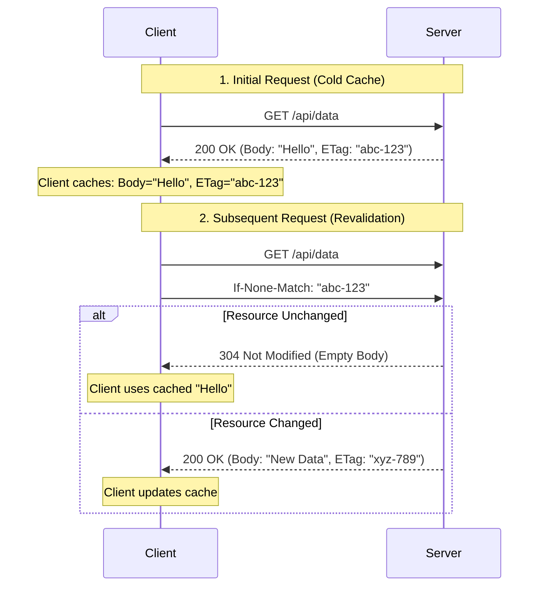

# HTTP Caching & ETag Masterclass

HTTP Caching is a critical performance optimization mechanism. It allows browsers and intermediate proxies to store responses and reuse them for subsequent requests, reducing latency and server load.

## 1. Theory: How Caching Works

### The Cache-Control Header
The primary way a server controls caching is via the `Cache-Control` header.

| Directive | Meaning |
|-----------|---------|
| `max-age=<seconds>` | How long (in seconds) the response is "fresh". Browser won't ask server again until this time passes. |
| `no-cache` | **Confusing name!** It means "Do not use the cache *without validating* with the server first". It forces a conditional request (ETag check). |
| `no-store` | **Never** store this response. Use for sensitive data (banking info). |
| `public` | Can be cached by anyone (CDNs, proxies, browsers). |
| `private` | Can only be cached by the end-user's browser (e.g., user-specific profile data). |

### The Validator: ETag (Entity Tag)
An **ETag** is a unique fingerprint (hash) of the resource.
1.  Server sends `ETag: "v1-hash"` with the response.
2.  Browser saves the response + ETag.
3.  Next time, browser sends `If-None-Match: "v1-hash"` to ask: *"Do you have a newer version than this?"*
4.  **Scenario A (No Change)**: Server replies `304 Not Modified` (Body is empty). Browser uses cached copy. **(Fast!)**
5.  **Scenario B (Changed)**: Server replies `200 OK` with new Body and new `ETag`.

#### Sequence Diagram (ETag Workflow)


---

## 2. Practical Lab: Caching with HTTPBin

We will use `httpbin.org` and `curl` to demonstrate caching behavior.

### Exercise 1: Cache-Control (max-age)
Let's see how `max-age` affects browser behavior. Since `curl` doesn't cache by itself, we inspect the headers.

**Request:**
```bash
curl -v -i "https://httpbin.org/cache/60"
```
*   `/cache/60`: Tells httpbin to return a `Cache-Control: max-age=60` header.

**Response Analysis:**
```http
HTTP/1.1 200 OK
...
Cache-Control: public, max-age=60
Date: Mon, 01 Jan 2024 10:00:00 GMT
...
```
*   **Interpretation**: "You can reuse this response for the next 60 seconds without talking to me."

### Exercise 2: ETag & 304 Not Modified
This is the most important concept to master. We will manually simulate the browser's behavior.

#### Step 1: Get the Resource (Find the ETag)
Run this command to get a resource with an ETag.
```bash
curl -v -i "https://httpbin.org/etag/my-test-tag"
```
*   `/etag/{etag}`: Tells httpbin to respond with the specified ETag.

**Output (Server Response):**
```http
HTTP/1.1 200 OK
Date: ...
ETag: "my-test-tag"
Content-Length: ...

(Response Body...)
```
Found the ETag: `"my-test-tag"`.

#### Step 2: Simulate Revalidation (The "If-None-Match" Header)
Now, pretend we are the browser. We have the file, but we want to know if it changed. We send the ETag back.

```bash
curl -i -H "If-None-Match: \"my-test-tag\"" "https://httpbin.org/etag/my-test-tag"
```
*   **Note**: We must escape quotes `\"` because ETags are strings. ETag format is strict!

**Output (The Magic):**
```http
HTTP/1.1 304 NOT MODIFIED
Date: ...
Connection: keep-alive
(Empty Body)
```
*   **Result**: The server returned `304`. No body was transferred. Bandwidth saved!

#### Step 3: Simulate a Change (Mismatch)
What if the file changed? Let's send an old/wrong ETag.

```bash
curl -i -H "If-None-Match: \"old-tag\"" "https://httpbin.org/etag/my-test-tag"
```

**Output:**
```http
HTTP/1.1 200 OK
ETag: "my-test-tag"
...
(Response Body...)
```
*   **Result**: The server saw the tags didn't match, so it sent the full `200 OK` response with the current data.

---

## 3. Interactive Scenario for Students

**Scenario**:
You are building a News Feed API. The news changes every 5 minutes.
However, you have a critical "Breaking News" banner that must update *instantly*.

**Question**: How do you configure caching for these two endpoints?

1.  `GET /api/news-feed` (Updates every 5 mins)
2.  `GET /api/breaking-news` (Must be instant)

<details>
<summary><b>Answer Key:</b></summary>

1.  **News Feed**: `Cache-Control: max-age=300` (5 minutes).
    *   *Why?* It's okay if users see 4-minute-old news. Greatly reduces server load.
2.  **Breaking News**: `Cache-Control: no-cache`.
    *   *Why?* `no-cache` forces the browser to check with the server (ETag) every time. If nothing changed, it gets a `304` (fast). If news broke, it gets `200` (instant update).
    *   *Wrong Answer*: `no-store` (This prevents caching entirely, meaning full download every time, even if nothing changed. `no-cache` is better/smarter).
</details>
