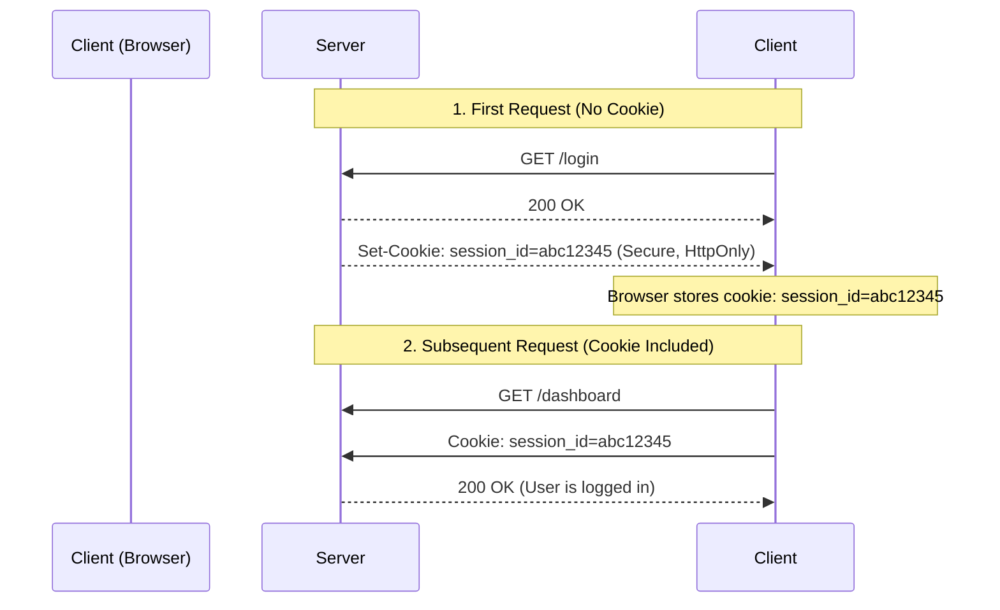

# HTTP Cookies Masterclass

Cookies are small pieces of data that a server sends to a user's web browser. The browser may store it and send it back with later requests to the same server.

## 1. Theory: Understanding Cookies

### What are Cookies Used For?
1.  **Session Management**: Logins, shopping carts, game scores.
2.  **Personalization**: User preferences, themes, language settings.
3.  **Tracking**: Recording and analyzing user behavior.

### How Cookies Work
The communication happens via HTTP Headers:

1.  **Server Sets Cookie**: The server sends a `Set-Cookie` header in the response.
2.  **Browser Stores Cookie**: The browser saves this data (if valid).
3.  **Client Sends Cookie**: For every subsequent request to the **same domain**, the browser automatically includes the `Cookie` header.

#### Sequence Diagram


### Anatomy of a Cookie
A cookie is a key-value pair with optional attributes that control its behavior.

`Set-Cookie: <name>=<value>; [Attributes]`

| Attribute | Description | Impact |
|-----------|-------------|--------|
| `Secure` | Send only over HTTPS | Prevents theft over unencrypted connections. |
| `HttpOnly` | Inaccessible to JavaScript | Prevents XSS attacks (malicious scripts stealing cookies). |
| `SameSite` | `Strict`, `Lax`, or `None` | Controls when cookies are sent with cross-site requests (CSRF protection). |
| `Domain` | e.g., `example.com` | Defines which hosts can receive the cookie. |
| `Path` | e.g., `/admin` | Defines which URL paths can receive the cookie. |
| `Expires` / `Max-Age` | Date or Seconds | Defines when the cookie is deleted. If missing, it's a **Session Cookie** (deleted when browser closes). |

---

## 2. Practical Lab: Cookies with HTTPBin

We will use `httpbin.org` (or a local instance) and `curl` to experiment with cookies.

### Tools Needed
*   **curl**: Command line tool for transferring data.
*   **httpbin**: A simple HTTP request & response service.

### Exercise 1: Setting a Cookie
Let's ask the server to set a cookie for us.

**Command:**
```bash
curl -i "https://httpbin.org/cookies/set?user_name=john_doe&theme=dark"
```
*   `-i`: Include protocol headers in the output (so we can see `Set-Cookie`).
*   `/cookies/set`: Endpoint that sets cookies based on query parameters.

**Response Analysis:**
Look for the `Set-Cookie` headers:
```http
HTTP/1.1 302 FOUND
...
Set-Cookie: user_name=john_doe; Path=/
Set-Cookie: theme=dark; Path=/
Location: /cookies
...
```
*Note: httpbin redirects to `/cookies` to show you the cookies it received.*

### Exercise 2: Sending Cookies (Simulating the Browser)
Since `curl` doesn't automatically store cookies like a browser, we have to manually send them or use a "cookie jar".

**Manual Method:**
```bash
curl -H "Cookie: user_name=john_doe; theme=dark" "https://httpbin.org/cookies"
```

**Response:**
```json
{
  "cookies": {
    "theme": "dark", 
    "user_name": "john_doe"
  }
}
```
The server received our cookies!

**Cookie Jar Method (Better):**
This saves cookies to a file and reuses them, acting like a real browser.

1.  **Set & Save**:
    ```bash
    curl -c cookies.txt "https://httpbin.org/cookies/set?session_id=Secret123"
    ```
    *   `-c cookies.txt`: Write cookies ("cookie jar") to this file.

2.  **Use & Send**:
    ```bash
    curl -b cookies.txt "https://httpbin.org/cookies"
    ```
    *   `-b cookies.txt`: Read cookies from this file.

### Exercise 3: Deleting a Cookie
To delete a cookie, the server sets its expiration date to the past.

**Simulate Deletion:**
```bash
curl -i "https://httpbin.org/cookies/delete?session_id"
```

**Response:**
```http
Set-Cookie: session_id=; Expires=Thu, 01 Jan 1970 00:00:00 GMT; Path=/
```
*   The value is empty.
*   The `Expires` date is in 1970 (Unix Epoch), instantly invalidating it.

---

## 3. Security Analysis

### HttpOnly Flag (The XSS Shield)
This is critical for security.
*   **With HttpOnly**: `document.cookie` in JavaScript returns **nothing**. Malicious scripts cannot read the session ID.
*   **Without HttpOnly**: `document.cookie` reveals the session ID, allowing attackers to hijack the account.

### SameSite Attribute (The CSRF Shield)
This prevents Cross-Site Request Forgery (CSRF).
*   `SameSite=Strict`: Cookie is **never** sent on cross-site requests (e.g., clicking a link from Facebook to your bank).
*   `SameSite=Lax` (Default): Cookie is sent when navigating to the origin site (safe top-level navigation) but not on sub-requests (images, frames).
*   `SameSite=None`: Cookie is sent on all interactions (requires `Secure` attribute).

### Interactive Question
> You are building a banking app. You store the `session_id` in a cookie.
> 1. Should you allow JavaScript to access it?
> 2. Should it be sent over HTTP?
> 3. What attributes must you set?
>
> **Answers:**
> 1. **No**. Set `HttpOnly`.
> 2. **No**. Set `Secure`.
> 3. **Result**: `Set-Cookie: session_id=xyz; Secure; HttpOnly; SameSite=Strict`

---

## 4. Hands-On: Chrome DevTools

The most common way developers interact with cookies is through the browser's Developer Tools.

### Step 1: Open the Cookie Panel
1.  Open Google Chrome and visit [httpbin.org/cookies/set?mycookie=tasty](https://httpbin.org/cookies/set?mycookie=tasty).
2.  Press **F12** (or Right Click -> Inspect) to open DevTools.
3.  Go to the **Application** tab (you might need to click the `>>` arrows if it's hidden).
4.  In the left sidebar, expand **Storage** -> **Cookies**.
5.  Click on `https://httpbin.org`.

### Step 2: Analyze the Columns
You will see a table with your cookies. Important columns to understand:

| Column | Meaning |
|--------|---------|
| **Name** | The key of the cookie (e.g., `mycookie`). |
| **Value** | The data stored (e.g., `tasty`). |
| **Domain** | Who can access this cookie (e.g., `httpbin.org`). |
| **Path** | URL path restriction (usually `/`). |
| **Expires / Max-Age** | When it dies. "Session" means it dies when you close the browser. |
| **HttpOnly** | A checkmark `✓` means JavaScript **cannot** access it. |
| **Secure** | A checkmark `✓` means it requires HTTPS. |
| **SameSite** | `Strict`, `Lax`, or `None`. |

### Step 3: Modify a Cookie
You can edit cookies directly in this panel!
1.  Double-click the **Value** of `mycookie`.
2.  Change it to `super_tasty` and press Enter.
3.  Refresh the page.
    *   The website now receives `super_tasty` from your browser!

### Step 4: Delete a Cookie
1.  Click the cookie to select it.
2.  Press the `Delete` key on your keyboard (or right-click -> "Delete").
3.  Refresh the page.
    *   The cookie is gone.

---
