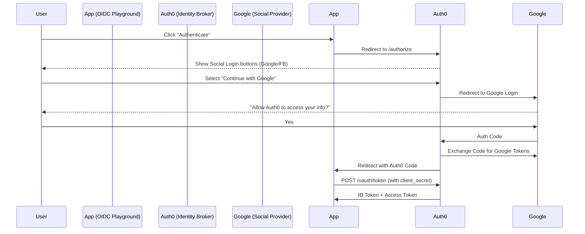

# OAuth2, OpenID Connect, and JWT Masterclass

This guide demystifies modern authentication and authorization protocols. We will cover the theory, manually inspect tokens, and perform a real-world integration with Google APIs.

## 1. Theory: The Big Three

### 1.1 OAuth2 (Delegated Authorization)
**Analogy**: Valet Key.
You give a valet driver a key that opens the car and starts the engine, but doesn't open the trunk. You (Resource Owner) delegate specific access to the Valet (Client) to use your Car (Resource).

*   **Goal**: "Allow this app to access my photos."
*   **Result**: An **Access Token**.
*   **Roles**:
    *   **Resource Owner**: You (the user).
    *   **Client**: The application (e.g., a website).
    *   **Authorization Server**: The system verifying your identity (e.g., Google, Auth0).
    *   **Resource Server**: The API holding your data (e.g., Google Photos API).

### 1.2 OpenID Connect - OIDC (Authentication)
**Analogy**: ID Card.
OAuth2 was only about *access*. It didn't tell the app *who* you are. OIDC adds an identity layer on top of OAuth2.

*   **Goal**: "Log in with Google."
*   **Result**: An **ID Token** (usually a JWT).
*   **Info**: Contains user details like `name`, `email`, `sub` (subject/user ID).

### 1.3 JWT (JSON Web Token)
**Analogy**: A sealed, transparent envelope.
A standardized container for sending data between parties. It is signed, so if anyone changes the data, the seal (signature) breaks.

---

## 2. JWT Anatomy

A JWT is just a long string comprising three parts separated by dots (`.`):
`Header.Payload.Signature`

### Part 1: Header (Algorithm & Token Type)
Describes *how* the token is signed.
```json
{
  "alg": "HS256",
  "typ": "JWT"
}
```

### Part 2: Payload (Claims)
The actual data. Standard claims include:
*   `sub` (Subject): User ID (e.g., "1234567890").
*   `name`: "John Doe".
*   `exp` (Expiration): Timestamp when the token dies.
*   `iat` (Issued At): Timestamp when it was created.

```json
{
  "sub": "1234567890",
  "name": "John Doe",
  "admin": true
}
```

### Part 3: Signature
Used to verify the token hasn't been tampered with.
`HMACSHA256(base64UrlEncode(header) + "." + base64UrlEncode(payload), secret)`

---

## 3. Hands-On: Using jwt.io

**Goal**: Inspect and understand a JWT without writing code.

1.  Go to **[jwt.io](https://jwt.io)**.
2.  Scroll to the "Debugger" section.
3.  **Experiment**:
    *   Look at the **Encoded** side (Left). Change a single character.
    *   Look at the **Decoded** side (Right). Notice the "Signature Verified" box at the bottom turns invalid/red.
    *   This proves that you cannot fake a token without the private key/secret.

---

## 4. Practical Lab: OIDC Playground & Brokered Auth

We will use the **[OpenID Connect Playground](https://openidconnect.net/)** to simulate a real application flow using Auth0 as an Identity Broker.

### Step 1: Configuration
1.  Open the [OIDC Playground](https://openidconnect.net/).
2.  Click Start button on  Redirect to OpenID Connect Server


### Step 2: The Authentication Flow
1.  Choose a login method (e.g., Google or GitHub).
2.  After logging in, you are redirected back with an `authorization_code`.
3.  Click **Exchange** to swap the code for tokens.
4.  Click **Verify/View Output** to see the ID Token and Access Token.

---

## 5. Understanding the Roles (The Brokered Flow)

In this lab, Auth0 act as a **broker**. It sits between the Playground and social providers (like Google).

### 5.1 OAuth Roles Mapping

| Role | Actor in Lab | Description |
| :--- | :--- | :--- |
| **Resource Owner** | You | The human logging in. |
| **Client** | OIDC Playground | The app requesting your identity. |
| **Authorization Server** | Auth0 | Issues tokens and validates the client. |
| **Resource Server** | Auth0 /userinfo | The API providing user profile data. |

### 5.2 Brokered Auth Diagram



---

## 6. Security Lab: The "Visible" Secret

### Exercise: The Mystery of the Client Secret
In Step 2, you saw the `client_secret` being sent in a POST request to `/oauth/token`.

**Question**: If this were a React or Angular Single Page App (SPA), should you include the `client_secret` in the code?

<details>
<summary>Click to see Answer</summary>

**NO.**
1.  **Browser is Public**: Anything in frontend code is visible to anyone via "View Source" or DevTools.
2.  **The Fix (PKCE)**: Modern browser apps use **PKCE** (Proof Key for Code Exchange) instead of a secret.
3.  **Confidential vs Public**:
    *   **Confidential Clients** (Backend servers): Use `client_secret`.
    *   **Public Clients** (Browsers/Mobile): Use PKCE.
</details>

---

## 7. Summary Comparison

| Protocol | Purpose | Key Characteristic | Analogy |
| :--- | :--- | :--- | :--- |
| **OAuth2** | Authorization | Delegates access to data. | Valet Key |
| **OIDC** | Authentication | Proves identity (who am I?). | ID Card |
| **JWT** | Data Format | Portable, signed container. | Sealed Envelope |

---

> [!TIP]
> **Key Takeaway**: Treat `client_secret` like a password. Only servers should hold it. If you're building a web frontend, use **PKCE** to keep your app secure!
