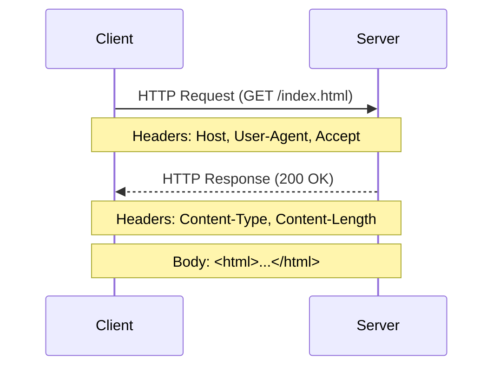
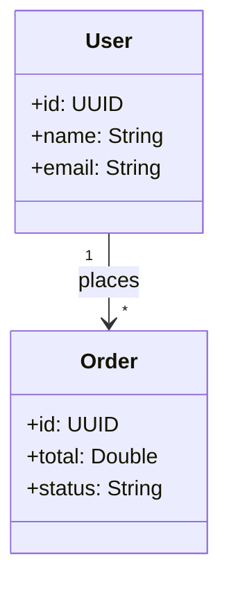
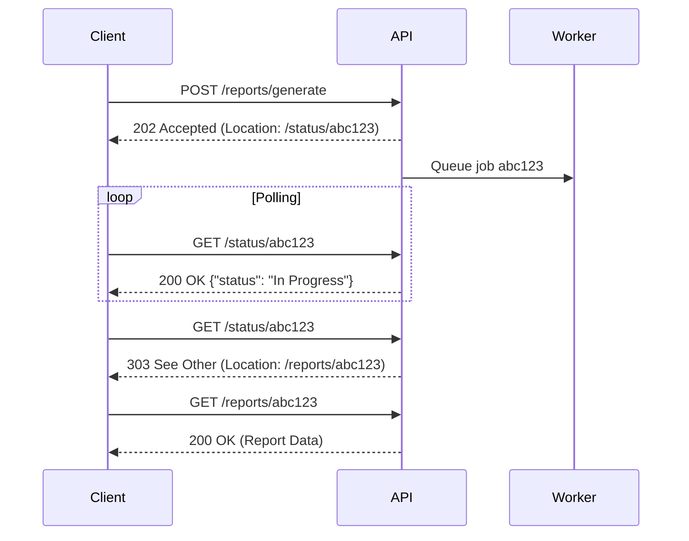
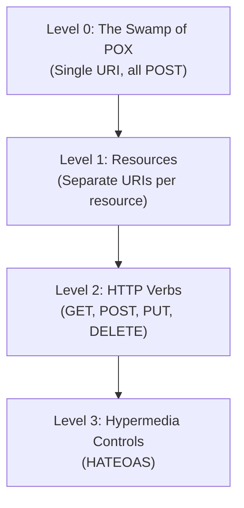
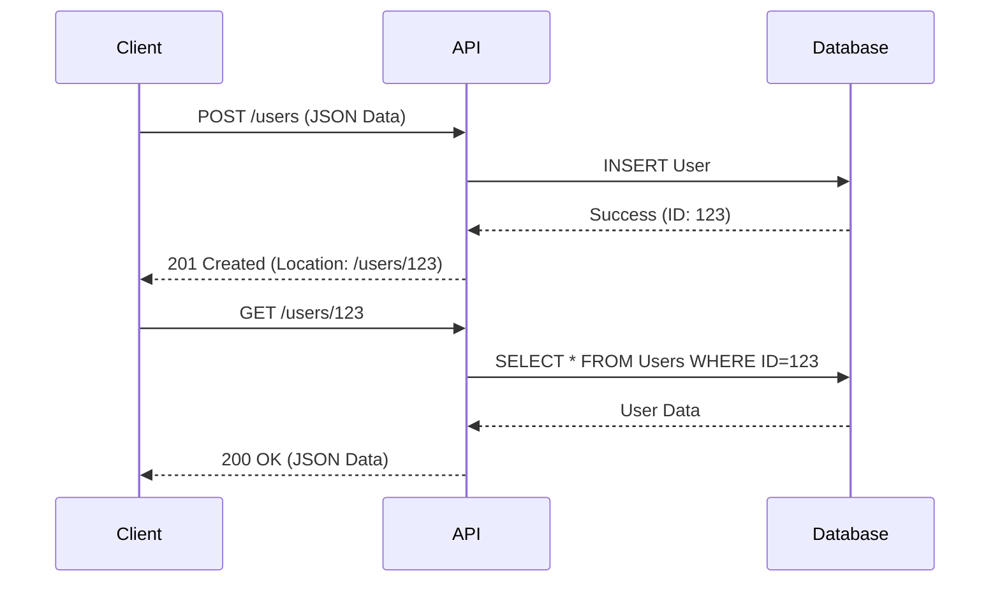

# REST API Course Requirements & Content

## 1. Course Overview & Objectives
This course is designed to provide a comprehensive understanding of RESTful APIs, from the underlying HTTP protocols to practical implementation in Java.

### Objectives
- Understand the core concepts of HTTP and how they apply to REST.
- Learn the principles of Resource-Oriented Architecture (ROA).
- Master REST API design best practices.
- Gain deep knowledge of the OpenAPI Specification (OAS).
- Implement a REST API server and client using Java.

---

## 2. HTTP Fundamentals
### 2.1 What is HTTP?
Hypertext Transfer Protocol (HTTP) is the foundation of data communication for the World Wide Web. It is an application layer protocol for distributed, collaborative, hypermedia information systems.

### 2.2 HTTP Request/Response Model
- **Request**: Sent by the client (e.g., browser, mobile app) to initiate an action.
  - Components: method, URL, headers, body.
- **Response**: Sent by the server to answer the client's request.
  - Components: status code, headers, body.

#### Visualizing the Flow


### 2.3 Statelessness
Each request from client to server must contain all of the information necessary to understand the request, and cannot take advantage of any stored context on the server.

**Interactive Question:**
> *Why is statelessness important for scalability?*
> **Answer:** It allows any server to handle any request, making it easier to scale horizontally since no session state needs to be synchronized between servers.

---

## 3. HTTP Methods
Standard methods (verbs) that indicate the desired action to be performed on the identified resource.

- **GET**: Retrieve a representation of a resource. Safe and Idempotent.
- **POST**: Submit an entity to the specified resource, often causing a change in state or side effects on the server. Not Idempotent.
- **PUT**: Replace all current representations of the target resource with the request payload. Idempotent.
- **PATCH**: Apply partial modifications to a resource. Not Idempotent (theoretically, though often implemented as such).
- **DELETE**: Delete the specified resource. Idempotent.
- **HEAD**: Same as GET, but transfers only the status line and headers (no body). Useful for checking if a resource exists or getting metadata.
- **OPTIONS**: Describes the communication options for the target resource. Used for CORS preflight requests.

### HTTP Methods Comparison Table:
| Method | Safe | Idempotent | Has Body | Use Case |
|--------|------|------------|----------|----------|
| GET | ✅ | ✅ | No | Retrieve resource |
| POST | ❌ | ❌ | Yes | Create resource |
| PUT | ❌ | ✅ | Yes | Replace resource |
| PATCH | ❌ | ❌ | Yes | Partial update |
| DELETE | ❌ | ✅ | No | Remove resource |
| HEAD | ✅ | ✅ | No | Check existence/metadata |
| OPTIONS | ✅ | ✅ | No | CORS preflight, API discovery |

**Problem Statement:**
> You are designing an API to manage user profiles. Which method would you use to:
> 1. Get user details? (GET /users/{id})
> 2. Create a new user? (POST /users)
> 3. Update a user's email address only? (PATCH /users/{id})

### 3.1 Idempotency and Safety
Understanding these properties is crucial for reliable API design.

- **Safe Methods**: Methods that do not modify resources (read-only).
  - Examples: `GET`, `HEAD`, `OPTIONS`.
  - *Key Takeaway*: You can cache these responses safely.

- **Idempotent Methods**: Methods that can be called multiple times with the same outcome as calling it once. `f(x) = f(f(x))`
  - Examples: `GET`, `PUT`, `DELETE`.
  - *Counter-example*: `POST` is NOT idempotent. If you send a "Create Order" request twice, you might get two orders.
  - *Why it matters*: If a client sends a `PUT` request and times out, they can safely retry the request without worrying about corrupting data.

**Interactive Scenario:**
> A payment API uses `POST /payments` to charge a card. If the client retries on timeout, the user might be charged twice. How can we fix this?
> **Solution**: Use an Idempotency Key in the header (e.g., `Idempotency-Key: <uuid>`). The server tracks processed keys and returns the cached response for duplicates.

---

## 4. HTTP Response Codes
Status codes issued by a server in response to a client's request made to the server.

### 4.1 2xx Success
- **200 OK**: Standard response for successful HTTP requests.
- **201 Created**: The request has been fulfilled and resulted in a new resource being created.
- **204 No Content**: The server successfully processed the request and is not returning any content.

### 4.2 3xx Redirection
- **301 Moved Permanently**: The URL of the requested resource has been changed permanently.
- **304 Not Modified**: Indicates that the resource has not been modified since the version specified by the request headers.

### 4.3 4xx Client Error
- **400 Bad Request**: The server cannot or will not process the request due to an apparent client error (e.g., malformed request syntax).
- **401 Unauthorized**: Authentication is required and has failed or has not yet been provided.
- **403 Forbidden**: The request was valid, but the server is refusing action. The user might not have the necessary permissions.
- **404 Not Found**: The requested resource could not be found but may be available in the future.

### 4.4 5xx Server Error
- **500 Internal Server Error**: A generic error message, given when an unexpected condition was encountered and no more specific message is suitable.
- **503 Service Unavailable**: The server is currently unavailable (because it is overloaded or down for maintenance).

---

## 5. Resource-Oriented Architecture (ROA)
ROA is a style of software architecture for distributed hypermedia systems.

### Core Concepts:
- **Resources**: Any information that can be named can be a resource (e.g., a document, an image, a collection of other resources).
- **URIs**: Uniform Resource Identifiers are used to address resources.
- **Representations**: Resources can be represented in various formats (JSON, XML, HTML).
- **Links**: Hypermedia controls (HATEOAS) allow clients to navigate the API dynamically.

#### Resource Relationship Diagram


---

## 6. Advanced REST Concepts

### 6.1 Content Negotiation
The mechanism that is used for serving different representations of a resource at the same URI, so that the user agent can specify which is best suited for the user.
- **Accept Header**: Client tells the server what it can handle (e.g., `application/json`, `application/xml`).
- **Content-Type Header**: Server tells the client what it is sending.

### 6.2 Caching
Improving performance and scalability by storing responses.
- **Cache-Control**: Directives for caching mechanisms in both requests and responses (e.g., `max-age=3600`, `no-cache`).
- **ETag**: A comprehensive mechanism for validation. If the resource hasn't changed, the server returns 304 Not Modified.

### 6.3 Security Fundamentals
- **HTTPS/TLS**: Encryption in transit.
- **Authentication**: Verifying who the user is (Basic Auth, API Keys, OAuth2/OIDC).
- **Authorization**: Verifying what the user is allowed to do (roles, permissions, scopes).

### 6.4 Asynchronous Operations (202 Accepted Pattern)
For long-running operations, avoid blocking the client. Instead, return `202 Accepted` with a status endpoint.



**Interactive Scenario:**
> Your API generates PDF reports that take 30 seconds. How do you handle this without a timeout?
> **Solution:** Use the 202 Accepted pattern. Return a status URL and let the client poll for completion.

### 6.5 Distributed Tracing (Correlation-ID)
In microservice architectures, tracing requests across services is essential for debugging.
- Use headers like `Correlation-ID`, `X-Request-ID`, or `X-Trace-ID`.
- The server should log and propagate this ID to downstream services.

```
Request:
  GET /orders/123
  Correlation-ID: 550e8400-e29b-41d4-a716-446655440000

Response:
  HTTP/1.1 200 OK
  Correlation-ID: 550e8400-e29b-41d4-a716-446655440000
  {...}
```

### 6.6 Avoiding "Chatty" APIs & Bulk Operations
- **Chatty APIs**: APIs that require many round-trips to fetch related data are inefficient.
  - *Solution*: Denormalize data, use compound resources (e.g., `/users?include=orders`), or GraphQL.
- **Bulk Operations**: Support batch updates/creates.
  - `PUT /users` with a body containing an array of user objects.
  - `POST /users/batch` for batch creation.

---

## 7. HATEOAS (Hypermedia as the Engine of Application State)
HATEOAS allows clients to navigate the API dynamically using links in responses.

### Example Response with Links:
```json
{
  "orderId": 3,
  "productId": 2,
  "quantity": 4,
  "orderValue": 16.60,
  "links": [
    { "rel": "self", "href": "/orders/3", "method": "GET" },
    { "rel": "cancel", "href": "/orders/3/cancel", "method": "POST" },
    { "rel": "customer", "href": "/customers/5", "method": "GET" }
  ]
}
```

**Key Benefit:** The client doesn't need to hardcode URLs; they can discover actions from the response.

---

## 8. Richardson Maturity Model (RMM)
A model to describe how "RESTful" an API is.



| Level | Description | Example |
|-------|-------------|---------|
| 0 | Single endpoint, all POST | `POST /api` with action in body |
| 1 | Multiple URIs for resources | `/users`, `/orders` |
| 2 | Uses HTTP methods correctly | `GET /users`, `DELETE /users/1` |
| 3 | Hypermedia links in responses | `links: [{rel: "self", ...}]` |

**Interactive Question:**
> An API has `/users` and `/orders` endpoints, uses GET/POST/PUT/DELETE correctly, but doesn't return any hypermedia links. What level is it?
> **Answer:** Level 2.

---

## 9. REST API Design
Best practices for designing clean, usable, and scalable APIs.

### 9.1 URI Naming Conventions
- **Nouns vs Verbs**: Use nouns in URIs, not verbs.
  - ✅ Good: `/products`
  - ❌ Bad: `/getProducts`
- **Pluralization**: Generally prefer plural nouns for collections.
  - `/users` instead of `/user`
- **Versioning**: Include versioning in the URI or headers.
  - `/v1/users`

---

### 9.2 Path Parameters
Path parameters are used to identify a **specific resource**. They are part of the URL path.

**Syntax:** `/resource/{id}`

#### Example: Get a Single User
```http
GET /users/42
```
**Response:**
```json
{
  "id": 42,
  "name": "Alice",
  "email": "alice@example.com"
}
```

#### Example: Get Orders for a Specific User
```http
GET /users/42/orders
```
**Response:**
```json
[
  { "orderId": 101, "total": 59.99 },
  { "orderId": 102, "total": 24.50 }
]
```

**Try it yourself (curl):**
```bash
curl -k -X GET "https://reqres.in/api/users/2"
```

**Interactive Question:**
> How would you design an endpoint to get a specific product from a specific category?
> **Answer:** `GET /categories/{categoryId}/products/{productId}`

---

### 9.3 Query Parameters
Query parameters are used for **filtering, sorting, searching, and pagination**. They come after the `?` in the URL.

**Syntax:** `/resource?param1=value1&param2=value2`

#### Common Use Cases:

| Use Case | Example |
|----------|--------|
| Filtering | `GET /products?category=electronics` |
| Sorting | `GET /products?sort=price&order=asc` |
| Searching | `GET /products?search=laptop` |
| Pagination | `GET /products?page=2&limit=10` |
| Multiple Filters | `GET /products?category=electronics&minPrice=100&maxPrice=500` |

#### Example: Search with Filters
```http
GET /products?category=electronics&brand=Sony&sort=price&order=desc
```
**Response:**
```json
[
  { "id": 1, "name": "Sony TV 55\"", "price": 899.99 },
  { "id": 2, "name": "Sony Headphones", "price": 299.99 }
]
```

**Try it yourself (curl):**
```bash
curl -k -X GET "https://dummyjson.com/products?category=smartphones&limit=10"
```

**Interactive Question:**
> How would you request users sorted by `created_at` in descending order, only showing active users?
> **Answer:** `GET /users?status=active&sort=created_at&order=desc`

---

### 9.4 Pagination Responses
When returning large collections, always paginate the response to avoid performance issues.

#### Pagination Strategies:

| Strategy | Description | Example |
|----------|-------------|---------|
| **Offset-based** | Use `page` and `limit` | `?page=2&limit=20` |
| **Cursor-based** | Use a cursor/token for next page | `?cursor=eyJpZCI6MTAwfQ==` |

#### Standard Pagination Response Structure:
```json
{
  "data": [
    { "id": 21, "name": "User 21" },
    { "id": 22, "name": "User 22" }
  ],
  "pagination": {
    "currentPage": 2,
    "totalPages": 10,
    "totalItems": 200,
    "itemsPerPage": 20,
    "hasNextPage": true,
    "hasPreviousPage": true
  },
  "links": {
    "self": "/users?page=2&limit=20",
    "first": "/users?page=1&limit=20",
    "prev": "/users?page=1&limit=20",
    "next": "/users?page=3&limit=20",
    "last": "/users?page=10&limit=20"
  }
}
```

#### Pagination Headers (Alternative):
Some APIs return pagination info in response headers:
```
X-Total-Count: 200
X-Page: 2
X-Per-Page: 20
Link: </users?page=1>; rel="first", </users?page=3>; rel="next"
```

**Problem Statement:**
> You're building a product catalog API. The database has 10,000 products. A client requests `GET /products`. What happens if you return all 10,000 at once?
> **Answer:** Memory overload, slow response, potential timeout. Solution: Default to 20-50 items per page and require pagination.

---

### 9.5 Request & Response Examples (Complete CRUD)

#### Create a User (POST)
```http
POST /users
Content-Type: application/json

{
  "name": "Bob",
  "email": "bob@example.com"
}
```
**Response (201 Created):**
```json
{
  "id": 43,
  "name": "Bob",
  "email": "bob@example.com",
  "createdAt": "2024-01-15T10:30:00Z"
}
```

#### Update a User (PUT - Full Replacement)
```http
PUT /users/43
Content-Type: application/json

{
  "name": "Robert",
  "email": "robert@example.com"
}
```
**Response (200 OK):**
```json
{
  "id": 43,
  "name": "Robert",
  "email": "robert@example.com"
}
```

#### Update a User (PATCH - Partial Update)
```http
PATCH /users/43
Content-Type: application/json

{
  "email": "newemail@example.com"
}
```
**Response (200 OK):**
```json
{
  "id": 43,
  "name": "Robert",
  "email": "newemail@example.com"
}
```

#### Delete a User
```http
DELETE /users/43
```
**Response (204 No Content):** *(empty body)*

#### Lifecycle Sequence Diagram


---

## 10. OpenAPI Specification (OAS)
The OpenAPI Specification (formerly Swagger Specification) is an API description format for REST APIs.

### 10.1 Detailed Sections

#### 10.1.1 `openapi`
Specifies the version of the OpenAPI Specification being used.
```
openapi: 3.0.3
```

#### 10.1.2 `info`
Provides metadata about the API.
- `title`: The title of the API.
- `description`: A description of the API.
- `version`: The version of the API definition.

#### 10.1.3 `servers`
An array of Server Objects, which provide connectivity information to a target server.
```yaml
servers:
  - url: https://api.example.com/v1
    description: Production server
```

#### 10.1.4 `paths`
The available paths and operations for the API. This is the core of the document.
```yaml
paths:
  /users:
    get:
      summary: Returns a list of users.
      responses:
        '200':
          description: A JSON array of user names
```

#### 10.1.5 `components`
An element to hold various schemas for the specification.
- `schemas`: Reusable data models.
- `responses`: Reusable responses.
- `parameters`: Reusable operation parameters.
- `examples`: Reusable examples.
- `requestBodies`: Reusable request bodies.
- `headers`: Reusable headers.
- `securitySchemes`: Security definitions.

#### 10.1.6 `security`
A declaration of which security mechanisms can be used across the API.

#### 10.1.7 `tags`
A list of tags used by the specification with additional metadata.

**Interactive Exercise:**
> Create a minimal OpenAPI spec for a "To-Do" application with a single endpoint `GET /todos`.

### 10.2 Complete OpenAPI Example
Here's a full working example you can use as a template:

```yaml
openapi: 3.0.3
info:
  title: User Management API
  description: A simple API to manage users
  version: 1.0.0
  contact:
    name: API Support
    email: support@example.com

servers:
  - url: https://api.example.com/v1
    description: Production
  - url: https://staging-api.example.com/v1
    description: Staging

paths:
  /users:
    get:
      summary: List all users
      tags:
        - Users
      parameters:
        - name: page
          in: query
          schema:
            type: integer
            default: 1
        - name: limit
          in: query
          schema:
            type: integer
            default: 20
      responses:
        '200':
          description: A paginated list of users
          content:
            application/json:
              schema:
                type: object
                properties:
                  data:
                    type: array
                    items:
                      $ref: '#/components/schemas/User'
                  pagination:
                    $ref: '#/components/schemas/Pagination'
    post:
      summary: Create a new user
      tags:
        - Users
      requestBody:
        required: true
        content:
          application/json:
            schema:
              $ref: '#/components/schemas/CreateUserRequest'
      responses:
        '201':
          description: User created successfully
          content:
            application/json:
              schema:
                $ref: '#/components/schemas/User'
        '400':
          description: Validation error
          content:
            application/json:
              schema:
                $ref: '#/components/schemas/Error'

  /users/{userId}:
    get:
      summary: Get a user by ID
      tags:
        - Users
      parameters:
        - name: userId
          in: path
          required: true
          schema:
            type: string
            format: uuid
      responses:
        '200':
          description: User details
          content:
            application/json:
              schema:
                $ref: '#/components/schemas/User'
        '404':
          description: User not found

components:
  schemas:
    User:
      type: object
      properties:
        id:
          type: string
          format: uuid
        name:
          type: string
        email:
          type: string
          format: email
        createdAt:
          type: string
          format: date-time

    CreateUserRequest:
      type: object
      required:
        - name
        - email
      properties:
        name:
          type: string
          minLength: 1
          maxLength: 100
        email:
          type: string
          format: email

    Pagination:
      type: object
      properties:
        currentPage:
          type: integer
        totalPages:
          type: integer
        totalItems:
          type: integer

    Error:
      type: object
      properties:
        code:
          type: string
        message:
          type: string
        details:
          type: array
          items:
            type: object

  securitySchemes:
    BearerAuth:
      type: http
      scheme: bearer
      bearerFormat: JWT

security:
  - BearerAuth: []

tags:
  - name: Users
    description: User management operations
```

---

### 10.3 API Versioning Strategies
As your API evolves, you need a strategy to handle breaking changes without disrupting existing clients.

#### Strategy 1: URI Versioning (Most Common)
```
GET /v1/users
GET /v2/users
```
✅ **Pros:** Explicit, easy to understand, cache-friendly
❌ **Cons:** URL pollution, harder to sunset old versions

#### Strategy 2: Query Parameter Versioning
```
GET /users?version=1
GET /users?version=2
```
✅ **Pros:** Keeps URL clean
❌ **Cons:** Easy to forget, not cache-friendly

#### Strategy 3: Header Versioning
```http
GET /users
Accept: application/vnd.myapi.v1+json
```
Or using a custom header:
```http
GET /users
X-API-Version: 2
```
✅ **Pros:** Clean URLs, follows HTTP spec
❌ **Cons:** Hidden, harder to test in browser

#### Strategy 4: Content Negotiation (Media Type Versioning)
```http
GET /users
Accept: application/vnd.myapi+json; version=2
```

#### Versioning Comparison Table:
| Strategy | URL Example | Pros | Cons |
|----------|-------------|------|------|
| URI | `/v1/users` | Clear, cacheable | URL changes |
| Query Param | `/users?v=1` | Simple | Not RESTful |
| Header | `X-API-Version: 1` | Clean URL | Hidden |
| Media Type | `Accept: ...v1+json` | Follows spec | Complex |

**Recommendation:** Start with **URI versioning** - it's the most widely used and easiest to understand.

---

## 11. Error Response Format
A consistent error response structure helps clients handle errors gracefully.

### Standard Error Response Structure:
```json
{
  "error": {
    "code": "VALIDATION_ERROR",
    "message": "Invalid request data",
    "details": [
      {
        "field": "email",
        "issue": "Invalid email format"
      },
      {
        "field": "age",
        "issue": "Must be a positive integer"
      }
    ],
    "timestamp": "2024-01-15T10:30:00Z",
    "traceId": "abc123-def456"
  }
}
```

### Common Error Codes:
| HTTP Status | Error Code | When to Use |
|-------------|------------|-------------|
| 400 | `VALIDATION_ERROR` | Invalid input data |
| 400 | `MALFORMED_REQUEST` | JSON parsing error |
| 401 | `UNAUTHORIZED` | Missing/invalid auth token |
| 403 | `FORBIDDEN` | Valid auth, but no permission |
| 404 | `NOT_FOUND` | Resource doesn't exist |
| 409 | `CONFLICT` | Duplicate resource (e.g., email already exists) |
| 422 | `UNPROCESSABLE_ENTITY` | Business logic validation failed |
| 500 | `INTERNAL_ERROR` | Unexpected server error |

**Interactive Question:**
> A user tries to register with an email that already exists. What status code and error code should you return?
> **Answer:** 409 Conflict with `CONFLICT` error code.

---

## 12. Rate Limiting (429 Too Many Requests)
Protect your API from abuse by limiting how many requests a client can make.

### Rate Limit Headers:
```http
HTTP/1.1 200 OK
X-RateLimit-Limit: 100
X-RateLimit-Remaining: 45
X-RateLimit-Reset: 1705320000
```

| Header | Description |
|--------|-------------|
| `X-RateLimit-Limit` | Max requests allowed in the window |
| `X-RateLimit-Remaining` | Requests remaining in current window |
| `X-RateLimit-Reset` | Unix timestamp when the limit resets |

### When Limit is Exceeded:
```http
HTTP/1.1 429 Too Many Requests
Retry-After: 60

{
  "error": {
    "code": "RATE_LIMIT_EXCEEDED",
    "message": "Too many requests. Please retry after 60 seconds."
  }
}
```

**Problem Statement:**
> Your API allows 100 requests per minute. A client has made 100 requests in 30 seconds. What do you return for the 101st request?
> **Answer:** 429 with `Retry-After: 30` (seconds until reset).

---

## 13. CORS (Cross-Origin Resource Sharing)
CORS is essential when your API is consumed by browser-based JavaScript applications.

### What is CORS?
Browsers block requests from one origin (e.g., `https://frontend.com`) to a different origin (e.g., `https://api.backend.com`) unless the server explicitly allows it.

### CORS Headers:
```http
HTTP/1.1 200 OK
Access-Control-Allow-Origin: https://frontend.com
Access-Control-Allow-Methods: GET, POST, PUT, DELETE
Access-Control-Allow-Headers: Content-Type, Authorization
Access-Control-Max-Age: 86400
```

| Header | Description |
|--------|-------------|
| `Access-Control-Allow-Origin` | Which origins can access (use `*` for public APIs) |
| `Access-Control-Allow-Methods` | Allowed HTTP methods |
| `Access-Control-Allow-Headers` | Allowed custom headers |
| `Access-Control-Max-Age` | How long to cache preflight response (seconds) |

### Preflight Request (OPTIONS):
For non-simple requests (e.g., with custom headers), browsers send a preflight:
```http
OPTIONS /api/users HTTP/1.1
Origin: https://frontend.com
Access-Control-Request-Method: POST
Access-Control-Request-Headers: Content-Type, Authorization
```

**Interactive Question:**
> Your React app on `localhost:3000` can't call your API on `localhost:8080`. What's the issue?
> **Answer:** CORS! Different ports = different origins. Configure your API to allow `localhost:3000`.

---

## 14. API Documentation Tools
Good documentation is essential for API adoption.

### Popular Tools:

| Tool | Description |
|------|-------------|
| **Swagger UI** | Interactive API explorer from OpenAPI spec |
| **Redoc** | Clean, responsive documentation from OpenAPI |
| **Postman** | API testing + auto-generated documentation |
| **Stoplight** | API design + documentation platform |

### Auto-Generate from Code:
Many frameworks can generate OpenAPI specs from your code:
- **Java**: Springdoc OpenAPI, Swagger Core
- **Node.js**: swagger-jsdoc
- **Python**: FastAPI (built-in), Flask-RESTX

---

## 15. Testing & Hands-On Labs

For practical exercises, including a **curl Cheatsheet** and **HTTPBin Laboratory**, please refer to the separate guide:

👉 **[REST API Tools & Labs](REST_API_TOOLS_AND_LABS.md)**

This guide covers:
- Tools for testing (curl, Postman, etc.)
- A comprehensive curl cheatsheet
- 10 Hands-on exercises using HTTPBin
- Challenge scenarios

---

## 17. Practical Implementation (Java)

### 17.1 Simple REST Server (using `com.sun.net.httpserver`)
We will build a simple server that handles `GET` requests to `/api/hello`.

### 17.2 Simple REST Client (using `java.net.http.HttpClient`)
We will build a client to consume the endpoint we created.

---
End of Document
