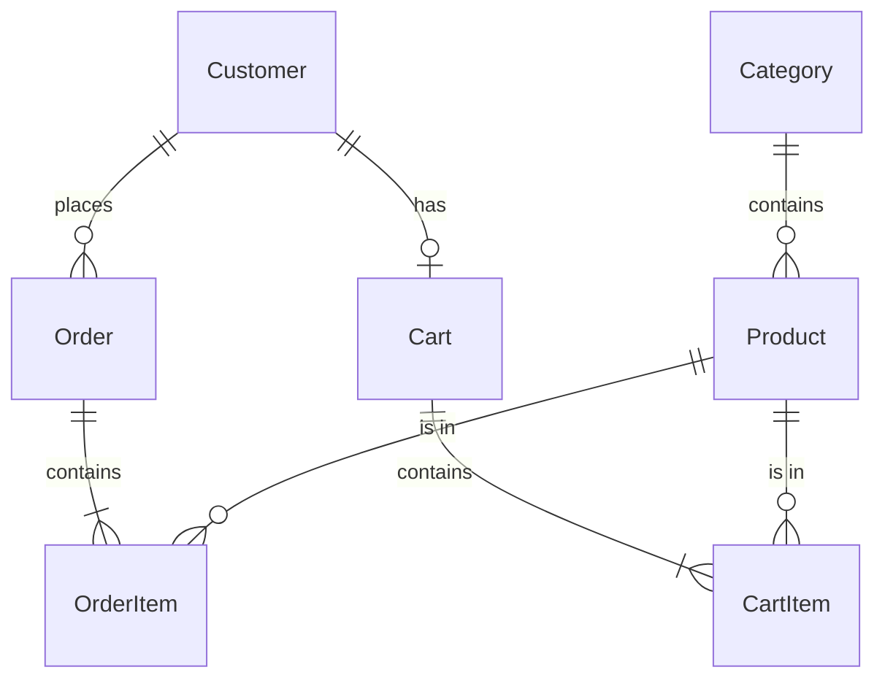
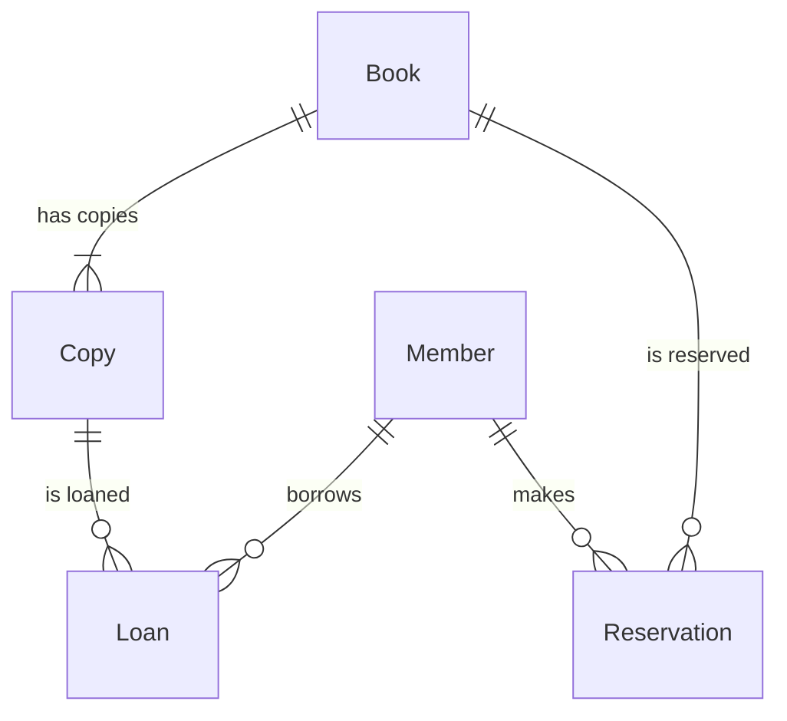
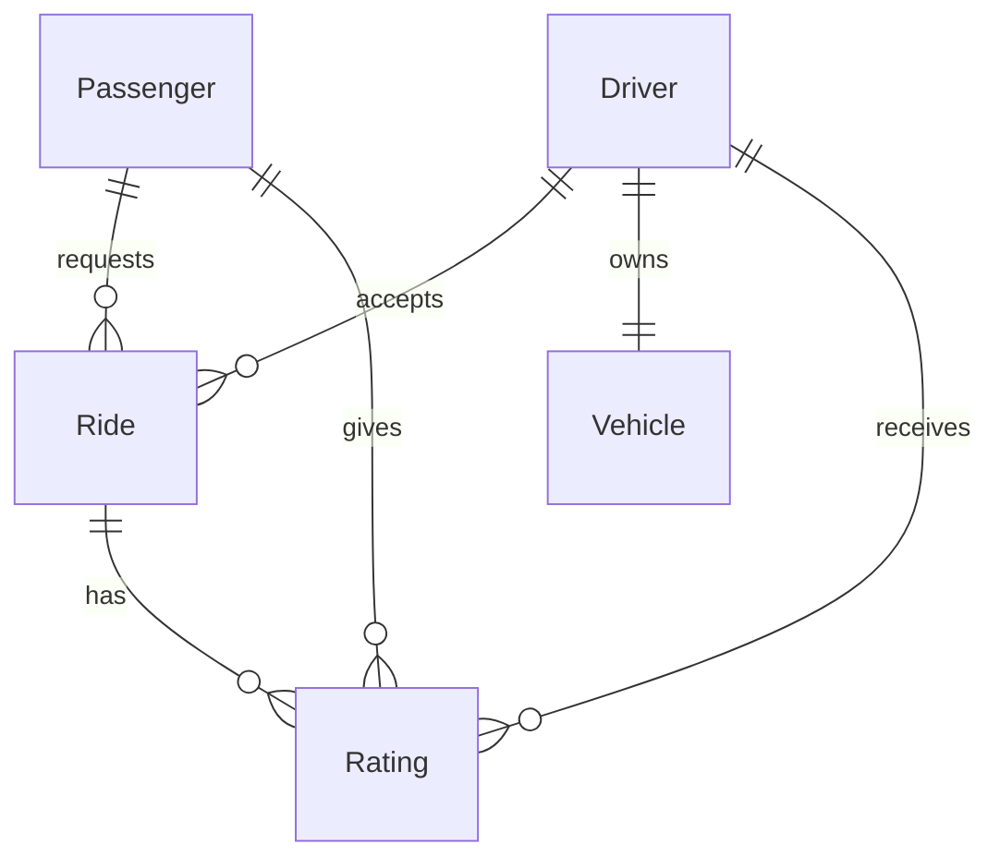

# REST API Design Lab

A hands-on workshop to practice identifying resources and designing REST APIs for real-world use cases.

---

## How to Approach API Design

Before designing any API, follow this process:

1. **Identify the Resources** (nouns) - What entities exist in the system?
2. **Define Relationships** - How are resources connected? (1-to-1, 1-to-many, many-to-many)
3. **Design Endpoints** - Map HTTP methods to operations on resources
4. **Plan Request/Response** - What data is sent and returned?

---

## Example 1: E-Commerce Platform (Explained)

### Use Case
Build an API for an online store where customers can browse products, add items to cart, and place orders.

### Step 1: Identify Resources

| Resource | Description |
|----------|-------------|
| **Products** | Items available for purchase |
| **Categories** | Product categories (Electronics, Clothing, etc.) |
| **Customers** | Registered users |
| **Cart** | Shopping cart for a customer |
| **Orders** | Placed orders |
| **Order Items** | Line items within an order |

### Step 2: Define Relationships



### Step 3: Design Endpoints

#### Products
| Method | Endpoint | Description |
|--------|----------|-------------|
| GET | `/products` | List all products (with pagination, filtering) |
| GET | `/products/{id}` | Get a specific product |
| POST | `/products` | Create a new product (admin) |
| PUT | `/products/{id}` | Update a product (admin) |
| DELETE | `/products/{id}` | Delete a product (admin) |
| GET | `/categories/{id}/products` | Get products in a category |

#### Cart
| Method | Endpoint | Description |
|--------|----------|-------------|
| GET | `/cart` | Get current user's cart |
| POST | `/cart/items` | Add item to cart |
| PATCH | `/cart/items/{productId}` | Update quantity |
| DELETE | `/cart/items/{productId}` | Remove item from cart |
| DELETE | `/cart` | Clear entire cart |

#### Orders
| Method | Endpoint | Description |
|--------|----------|-------------|
| GET | `/orders` | List user's orders |
| GET | `/orders/{id}` | Get order details |
| POST | `/orders` | Place a new order (checkout) |
| PATCH | `/orders/{id}/cancel` | Cancel an order |

### Step 4: Sample Request/Response

**POST /cart/items** - Add to Cart
```json
// Request
{
  "productId": "prod-123",
  "quantity": 2
}

// Response (201 Created)
{
  "cartId": "cart-456",
  "items": [
    {
      "productId": "prod-123",
      "name": "Wireless Headphones",
      "quantity": 2,
      "unitPrice": 79.99,
      "subtotal": 159.98
    }
  ],
  "total": 159.98
}
```

**POST /orders** - Place Order
```json
// Request
{
  "shippingAddress": {
    "street": "123 Main St",
    "city": "San Francisco",
    "zip": "94102"
  },
  "paymentMethod": "card_token_abc123"
}

// Response (201 Created)
{
  "orderId": "ord-789",
  "status": "PENDING",
  "total": 159.98,
  "estimatedDelivery": "2024-01-20",
  "links": {
    "self": "/orders/ord-789",
    "cancel": "/orders/ord-789/cancel"
  }
}
```

### Key Design Decisions

| Decision | Rationale |
|----------|-----------|
| `/cart` instead of `/customers/{id}/cart` | Cart is implicit for authenticated user |
| `PATCH /orders/{id}/cancel` | Action endpoint for state change |
| Nested `/categories/{id}/products` | Natural hierarchy for browsing |

---

## Example 2: Library Management System (Exercise)

### Use Case
Build an API for a library where members can search books, borrow items, and manage their account.

### Step 1: Identify Resources
*Think about the entities involved in a library system.*

| Resource | Description |
|----------|-------------|
| ? | ? |
| ? | ? |
| ? | ? |

### Step 2: Define Relationships
*How do books, copies, and members relate to each other?*

### Step 3: Design Endpoints

#### Books & Copies
| Method | Endpoint | Description |
|--------|----------|-------------|
| ? | ? | ? |
| ? | ? | ? |

#### Loans
| Method | Endpoint | Description |
|--------|----------|-------------|
| ? | ? | ? |

### Step 4: Sample Request/Response
*Draft a JSON payload for borrowing a book.*

---

<details>
<summary>📖 Click to reveal Solution</summary>

### Solution: Library Management System

#### Resources Identified

| Resource | Description |
|----------|-------------|
| **Books** | Book titles in the library catalog |
| **Copies** | Physical copies of a book (a book can have multiple copies) |
| **Members** | Library members |
| **Loans** | Active/historical borrowing records |
| **Reservations** | Book reservations when all copies are out |

#### Relationships



#### Endpoints

**Books & Copies**
| Method | Endpoint | Description |
|--------|----------|-------------|
| GET | `/books` | Search/list books (?q=python&available=true) |
| GET | `/books/{isbn}` | Get book details |
| GET | `/books/{isbn}/copies` | List copies of a book |
| GET | `/books/{isbn}/copies/{copyId}` | Get specific copy status |

**Loans**
| Method | Endpoint | Description |
|--------|----------|-------------|
| GET | `/members/{id}/loans` | Get member's active loans |
| POST | `/loans` | Borrow a book (create loan) |
| PATCH | `/loans/{id}/return` | Return a book |
| PATCH | `/loans/{id}/renew` | Extend loan period |

**Reservations**
| Method | Endpoint | Description |
|--------|----------|-------------|
| GET | `/members/{id}/reservations` | Get member's reservations |
| POST | `/reservations` | Reserve a book |
| DELETE | `/reservations/{id}` | Cancel reservation |

#### Sample Request/Response

**POST /loans** - Borrow a Book
```json
// Request
{
  "memberId": "mem-001",
  "copyId": "copy-123"
}

// Response (201 Created)
{
  "loanId": "loan-456",
  "book": {
    "isbn": "978-0134685991",
    "title": "Effective Java"
  },
  "copyId": "copy-123",
  "borrowedAt": "2024-01-15T10:00:00Z",
  "dueDate": "2024-01-29T23:59:59Z",
  "status": "ACTIVE"
}
```

**PATCH /loans/{id}/renew** - Renew Loan
```json
// Response (200 OK)
{
  "loanId": "loan-456",
  "renewalCount": 1,
  "maxRenewals": 2,
  "newDueDate": "2024-02-12T23:59:59Z"
}
```

#### Key Design Decisions

| Decision | Rationale |
|----------|-----------|
| Separate `Book` and `Copy` | A book (title) can have multiple physical copies |
| `/loans/{id}/return` action | State change, not a full resource update |
| ISBN as book identifier | Standard identifier for books |
| Member nested under `/members/{id}/loans` | Loans belong to a member |

</details>

---

## Exercise: Design a Ride-Sharing API

### Use Case
Design an API for a ride-sharing service (like Uber/Ola) where passengers can request rides and drivers can accept them.

### Your Task

Think about the following scenarios:
- A passenger opens the app and requests a ride
- Nearby drivers see the request
- A driver accepts the ride
- The ride progresses through states (REQUESTED → ACCEPTED → IN_PROGRESS → COMPLETED)
- After the ride, both parties can rate each other
- Users can view ride history

### Step 1: Identify Resources

Fill in the resources you think are needed:

| Resource | Description |
|----------|-------------|
| ? | ? |
| ? | ? |
| ? | ? |
| ? | ? |
| ? | ? |

### Step 2: Define Relationships

> Draw or describe the relationships between your resources.

### Step 3: Design Endpoints

#### Rides
| Method | Endpoint | Description |
|--------|----------|-------------|
| ? | ? | ? |
| ? | ? | ? |
| ? | ? | ? |
| ? | ? | ? |

#### Drivers
| Method | Endpoint | Description |
|--------|----------|-------------|
| ? | ? | ? |
| ? | ? | ? |

#### Ratings
| Method | Endpoint | Description |
|--------|----------|-------------|
| ? | ? | ? |

### Step 4: Sample Request/Response

Design the request/response for:
1. Requesting a ride
2. Driver accepting a ride
3. Completing a ride and submitting a rating

---

<details>
<summary>📖 Click to reveal Solution</summary>

### Solution: Ride-Sharing API

#### Resources Identified

| Resource | Description |
|----------|-------------|
| **Passengers** | Users who request rides |
| **Drivers** | Users who provide rides |
| **Vehicles** | Cars registered by drivers |
| **Rides** | Individual ride requests/trips |
| **Ratings** | Reviews given after rides |
| **Locations** | Pickup/dropoff coordinates |

#### Relationships



#### Endpoints

**Rides**
| Method | Endpoint | Description |
|--------|----------|-------------|
| POST | `/rides` | Request a new ride |
| GET | `/rides/{id}` | Get ride details/status |
| GET | `/passengers/{id}/rides` | Get passenger's ride history |
| GET | `/drivers/{id}/rides` | Get driver's ride history |
| PATCH | `/rides/{id}/accept` | Driver accepts ride |
| PATCH | `/rides/{id}/start` | Driver starts the ride |
| PATCH | `/rides/{id}/complete` | Complete the ride |
| PATCH | `/rides/{id}/cancel` | Cancel the ride |

**Drivers**
| Method | Endpoint | Description |
|--------|----------|-------------|
| PATCH | `/drivers/{id}/status` | Set driver online/offline |
| GET | `/drivers/{id}/nearby-rides` | Get available ride requests |

**Ratings**
| Method | Endpoint | Description |
|--------|----------|-------------|
| POST | `/rides/{id}/ratings` | Submit rating for a ride |
| GET | `/drivers/{id}/ratings` | Get driver's ratings |

#### Sample Requests

**POST /rides** - Request a Ride
```json
// Request
{
  "pickupLocation": {
    "lat": 12.9716,
    "lng": 77.5946,
    "address": "MG Road, Bangalore"
  },
  "dropoffLocation": {
    "lat": 12.9352,
    "lng": 77.6245,
    "address": "Koramangala, Bangalore"
  },
  "rideType": "STANDARD"
}

// Response (201 Created)
{
  "rideId": "ride-001",
  "status": "REQUESTED",
  "estimatedFare": 250.00,
  "estimatedDuration": "18 mins",
  "estimatedDistance": "8.5 km"
}
```

**PATCH /rides/{id}/accept** - Driver Accepts
```json
// Request
{
  "driverId": "driver-123"
}

// Response (200 OK)
{
  "rideId": "ride-001",
  "status": "ACCEPTED",
  "driver": {
    "id": "driver-123",
    "name": "Ravi Kumar",
    "rating": 4.8,
    "vehicle": {
      "model": "Swift Dzire",
      "plateNumber": "KA-01-AB-1234"
    }
  },
  "eta": "3 mins"
}
```

**POST /rides/{id}/ratings** - Submit Rating
```json
// Request
{
  "rating": 5,
  "comment": "Great ride, very professional driver!",
  "ratedBy": "passenger"
}

// Response (201 Created)
{
  "ratingId": "rating-789",
  "rideId": "ride-001",
  "rating": 5,
  "createdAt": "2024-01-15T15:30:00Z"
}
```

</details>

---

## Design Checklist

Use this checklist when designing any REST API:

- [ ] Resources are **nouns**, not verbs
- [ ] Endpoints use **plural** names (`/users`, not `/user`)
- [ ] Relationships are reflected in **nested URLs** where appropriate
- [ ] HTTP methods match operations (GET=read, POST=create, etc.)
- [ ] **Pagination** is considered for list endpoints
- [ ] **Filtering/Sorting** uses query parameters
- [ ] Status codes are appropriate (201 for create, 204 for delete, etc.)
- [ ] Error responses are consistent
- [ ] HATEOAS links are provided where useful

---

## Additional Practice Scenarios

Try designing APIs for these systems:

1. **Hotel Booking System** - Hotels, Rooms, Reservations, Guests
2. **Food Delivery App** - Restaurants, Menu Items, Orders, Delivery Partners
3. **Social Media Platform** - Users, Posts, Comments, Likes, Followers
4. **Online Learning Platform** - Courses, Lessons, Enrollments, Progress
5. **Banking System** - Accounts, Transactions, Beneficiaries, Statements

---
